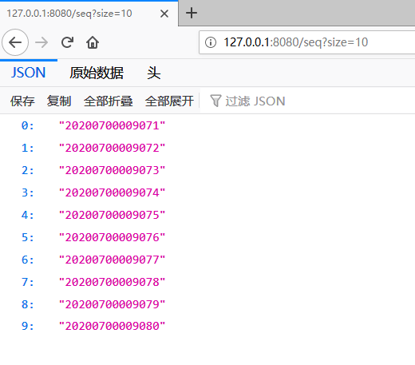
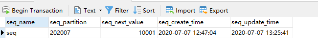
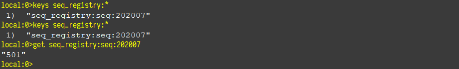

# JAVA 序号工具包 Sequence
[](https://www.codefactor.io/repository/github/power4j/sequence/overview/master)
[](https://codebeat.co/projects/github-com-power4j-sequence-master)
[](https://codecov.io/gh/power4j/sequence)
[](https://travis-ci.org/github/power4j/sequence)
[](https://maven-badges.herokuapp.com/maven-central/com.power4j.kit/sequence)

使用场景

- 业务需要根据一定的规则生成序号，如：
  - 连续性：序号连续自增地进行分配
  - 相关性：多租户隔离、按年、月、日分区
  - 特定格式: 序号输出的格式灵活可控
- 技术上需要满足
  - 高性能
  - 线程安全
  - 适用性好
  - 配置简单、容易集成

## 项目说明

- ***JDK 版本要求: `JDK8+`*** 

## 核心概念

- 号池(`SeqPool`): 一种设施，可以提供有限或者无限的序号。
- 同步器(`SeqSynchronizer`): 负责与某种后端(如数据库)交互,更新序号的当前值。
- 取号器(`SeqHolder`): 负责缓存从后端批量取出的序号，然后交给本地的号池来管理。

## 使用方法


引入依赖
```xml
<dependency>
    <groupId>com.power4j.kit</groupId>
    <artifactId>sequence-spring-boot-starter</artifactId>
    <version>最新版本</version>
</dependency>
```

开启配置(JDBC)
```yaml
power4j:
  sequence:
    # 数据同步使用的后端支持(如: mysql,oracle,redis),跟你实际使用的数据源类型对应
    backend: mysql
```

也可以使用Redis，则配置方式为

```yaml
power4j:
  sequence:
    backend: redis
    lettuce-uri: "redis://127.0.0.1"
```

使用

```java
@RestController
@SpringBootApplication
public class SequenceExampleApplication {
    @Autowired
    private Sequence<Long> sequence;
    public static void main(String[] args) {
        SpringApplication.run(SequenceExampleApplication.class, args);
    }

    @GetMapping("/seq")
    public List<String> getSequence(@RequestParam(required = false) Integer size) {
        size = (size == null || size <= 0) ? 10 : size;
        List<String> list = new ArrayList<>(size);
        for (int i = 0; i < size; ++i) {
            list.add(sequence.nextStr());
        }
        return list;
    }
}
```

## 性能测试结果
> 测试环境用的Redis,MySQL等外部服务都是默认安装，没有调整参数。

测试环境一: 腾讯云1核(2.6G)2G `CentOS7.6`
```shell
# Detecting actual CPU count: 1 detected
# JMH version: 1.23
# VM version: JDK 1.8.0_252, OpenJDK 64-Bit Server VM, 25.252-b09
# VM invoker: /usr/lib/jvm/java-1.8.0-openjdk-1.8.0.252.b09-2.el7_8.x86_64/jre/bin/java
# VM options: -server -Xms32m -Xmx128m -Xmn64m -XX:CMSInitiatingOccupancyFraction=82 -Xss256k -XX:LargePageSizeInBytes=64m

Benchmark                               Mode  Cnt          Score           Error  Units
LettuceSeqHolderBench.longSeqPoolTest  thrpt    3    3564558.441 ±   1702568.310  ops/s
LongSeqPoolBench.longSeqPoolTest       thrpt    3  176150209.446 ± 198945560.565  ops/s
MySqlSeqHolderBench.longSeqPoolTest    thrpt    3      80548.505 ±     67809.940  ops/s
```
分数: 裸奔: 1.76亿, redis: 350万,MySQL:8万 

测试环境二: 台式机8核(7700K,4.5G) 32G `Windows 10`
```shell
# Detecting actual CPU count: 8 detected
# JMH version: 1.23
# VM version: JDK 1.8.0_191, Java HotSpot(TM) 64-Bit Server VM, 25.191-b12
# VM invoker: C:\app64\Java\jre1.8.0_191\bin\java.exe
# VM options: -server -Xms32m -Xmx128m -Xmn64m -XX:CMSInitiatingOccupancyFraction=82 -Xss256k -XX:LargePageSizeInBytes=64m

Benchmark                               Mode  Cnt         Score         Error  Units
LettuceSeqHolderBench.longSeqPoolTest  thrpt    3   2866317.433 ±  746605.597  ops/s
LongSeqPoolBench.longSeqPoolTest       thrpt    3  11794922.340 ± 1419640.822  ops/s
MySqlSeqHolderBench.longSeqPoolTest    thrpt    3    702611.142 ±  291359.343  ops/s
```
分数: 裸奔: 1179万, redis: 286万,MySQL:70万 


> - 你没有看错，4核8线程，默频4.5G的7700K被单核单线程2.6G的服务器CPU吊打。
> - 分数看看就好,纯跑分没什么意义。

## 效果演示

### 分配10个序号


### 数据库中的记录


### Redis中的记录


## 开发计划

 - [X] 支持MySQL
 - [ ] 支持PostgreSQL
 - [ ] 支持H2
 - [ ] 支持Oracle
 - [x] 支持Redis
 - [ ] 支持MongoDB
 - [X] Spring Boot 集成

 ## 贡献指南

 代码要求：
  - 统一风格，包含注释、代码缩进等与本项目保持一致
  - 保持代码整洁，比如注释掉的代码块等垃圾代码应该删除
  - 严格控制外部依赖，如果没有必要，请不要引入外部依赖
  - 请在类注释中保留你的作者信息，请不要害羞

 ### 数据库支持实现

 1. 参考[`MySqlSynchronizer`](sequence-core/src/main/java/com/power4j/kit/seq/persistent/provider/MySqlSynchronizer.java)的实现方式，实现某个特定数据库后端的支持
 2. 参考[`MySqlSynchronizerTest`](sequence-core/src/test/java/com/power4j/kit/seq/persistent/provider/MySqlSynchronizerTest.java) 编写单元测试，完成自测。如果你的代码能跑通测试，基本上应该没有严重bug

 